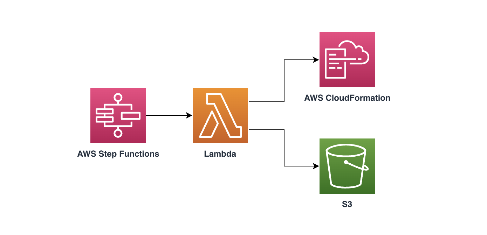

# Stack Workflow Construct

## Overview
This AWS Solutions Construct implements a state machine (AWS Step Functions) to manage the execution flow of multiple stacks (AWS CloudFormation).

Here is a minimal deployable pattern definition:

**Typescript**

```ts
import { Construct } from 'constructs';
import { Stack, StackProps } from 'aws-cdk-lib';
import { CSDCStackWorkflow } from 'stack-workflow';

new CSDCStackWorkflow(this, 'test-stack-workflow');
```

## Deployment

### Preparations

- Make sure you have an AWS account
- Configure [credential of aws cli](https://docs.aws.amazon.com/zh_cn/cli/latest/userguide/cli-chap-configure.html)
- Install Node.js LTS version 18.17.0 or later
- Install Docker Engine
- Install the dependencies of the solution by executing the command `yarn install --check-files && npx projen`
- Initialize the CDK toolkit stack into AWS environment (only for deploying via [AWS CDK](https://aws.amazon.com/cdk/) for the first time), and run `npx cdk bootstrap`

### Deploy the construct

```shell
cdk deploy --app='./lib/integ.default.js' --require-approval never
```

### Test

```shell
yarn test
```

## Architecture


## Default settings
Out of the box implementation of the Construct without any override will set the following defaults:

### AWS Step Functions
- Workflow state machine timeout is 2 hours, stack action state machine timeout is 1 hour
- Specifies Amazon X-Ray tracing is enabled for state machine

### AWS CloudFormation
- Create stack with `DisableRollback:true`
- **Disable** termination protection on the specified stack
- Explicitly acknowledge that stack template contains certain capabilities(`CAPABILITY_IAM, CAPABILITY_NAMED_IAM, CAPABILITY_AUTO_EXPAND`) in order for CloudFormation to create the stack

### Amazon S3 Bucket
- Configure Access logging for S3 Bucket
- Enable server-side encryption for S3 Bucket using AWS managed KMS Key
- Enforce encryption of data in transit
- **Turn on** the versioning for S3 Bucket
- **Don't allow** public access for S3 Bucket
- **Retain** the S3 Bucket when deleting the CloudFormation stack
- Applies Lifecycle rule to move noncurrent object versions to Glacier storage after 90 days

## License

This project is licensed under the Apache-2.0 License.

## Acknowledgements

This project utilizes [projen](https://github.com/projen/projen).